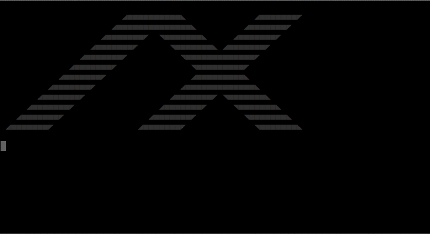
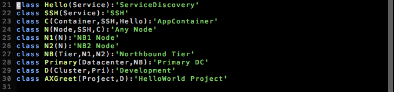
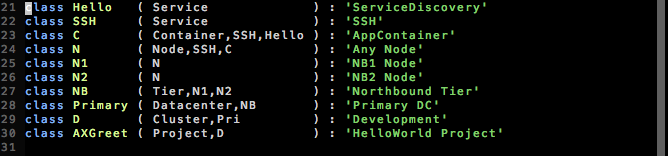
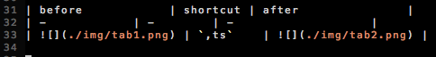
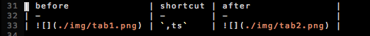

# Vim Enhancements

To record stuff from the terminal:
- register at https://asciinema.org
- `asciinema rec --title="vim tabularize" -w 0.5`
- when done: press enter -> you get a link, there you get the markdown for the recording.

To create animated gifs:

    brew install ttygif
    ttyrec
    ...
    exit
    ttygif ttyrecord

## [Tabularize](http://vimcasts.org/episodes/aligning-text-with-tabular-vim/)

https://github.com/godlygeek/tabular

    Plugin 'gg/tabular'

</img>

### Shortcuts in .vimrc

E.g. for markdown tables (shows how to escape the pipe):

    map <Leader>t\| :Tabularize/\|<CR>

More tab. actions in one command:

    map <Leader>ts :Tabularize/(<CR><bar>:Tabularize/)<CR><bar>:Tabularize/:<CR>

| before               | shortcut | after                |
| -                    | -        | -                    |
|   | `,ts`    |   |
|  | `,t❘`    |  |

(leader set to `,`)

## Correctly Indented Breakpoint

    let mapleader = ","
    map <Leader>b Oimport pdb; pdb.set_trace()<C-c>

hitting `,b` inserts a breakpoint the line above, correctly indented, no
matter where you are with the cursor:

## Wrapping try-except around a problematic line

    map <Leader>e Otry:<Esc>j^i<TAB><Esc>oexcept Exception as ex:<CR>import pdb;pdb.set_trace()<Esc>^

hitting `,e`:

## General Tips

### Pastemode

Use neovim - it is automatically going to pastemode at inserts.
Or [this](https://coderwall.com/p/if9mda/automatically-set-paste-mode-in-vim-when-pasting-in-insert-mode) (did not try though)

